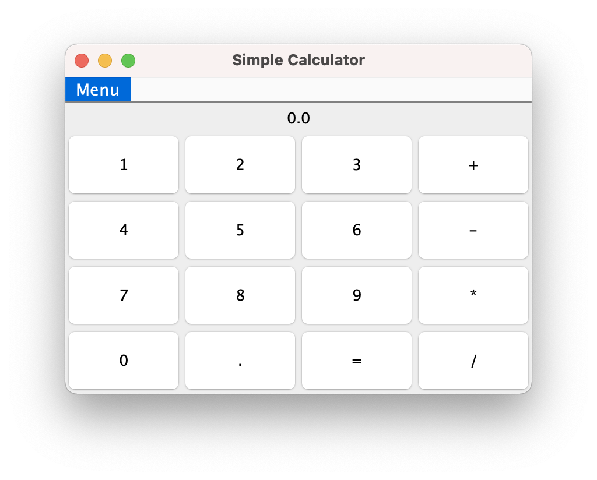

# MVC-Calculator
MVC-Calculator is a Java example using the MVC design pattern to simulate a simple calculator. This calculator has two views a graphical user interface (GUI) using Java Swing and a command line interface (CLI). 



# Latest version
Download the latest version [here](https://github.com/CIS-Projects-in-CS-S21/mvc-calculator-template/releases).  

# Usage
Uncompress the file zip and run the platform specific script available under bin. More 


# Building
Use your favorite Java IDE to edit, build, run and test. Or do it on the command line with gradle. 
```
gradle build
gradle test
gradle run 
```

# Testing on the command line
To test the command line interface set the "args" parameter in your IDE to a string representing the sequence of keys to pres like 1+2=. Or do it form the command line:     
```
gradle build
java -jar calculator/build/libs/calculator.jar 1+2=
3
```
Note that the result of "3+4" will correctly be 4. As when using the calculator after pressing the key 4 the display will show 4, 7 will only by diplayed after pressing =. 
```
gradle build
java -jar calculator/build/libs/calculator.jar 3+4
4
java -jar calculator/build/libs/calculator.jar 3+4=
7
```
